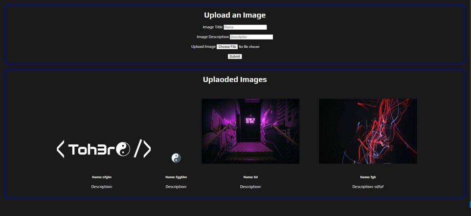

# Uploading Images to MongoDB using Multer

This is just a simple app that allows you to upload images to MongoDB

#### Run
In the terminal ->
Run 'npm install' to download npm packages
Run 'npm run dev' (Uses nodemon) or 'npm run start'

#### Packages Used
* Express
* Mongoose
* Ejs
* Multer

#### Screen Shot

